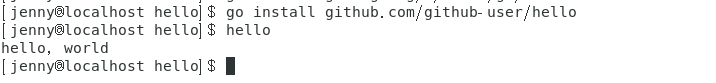

# 使用Go编程

## Linux下环境配置

在开始的开始，我们先安装代码编辑器——visual studio code。打开终端输入下面两行就可以了。

```shell
yum check-update
sudo yum install code
```

然后安装`golang`

```shell
sudo yum install golang
```

创建工作空间

```shell
mkdir $HOME/gowork
```

设置环境变量

```shell
export GOPATH=$HOME/gowork
export PATH=$PATH:$GOPATH/bin
```

执行配置

```shell
source $HOME/.profile
```

创建源代码目录：

```shell
mkdir $GOPATH/src/github.com/github-user/hello -p
```

使用 vs code 创建 hello.go

```shell
package main

import "fmt"

func main() {
    fmt.Printf("hello, world\n")
}
```


在终端相应路径里运行

```shell
go run hello.go
```


安装 Git 客户端

```shell
sudo yum install git
```

安装 go 的一些工具

下载源代码到本地

```shell
mkdir $GOPATH/src/golang.org/x/
go get -d github.com/golang/tools
cp $GOPATH/src/github.com/golang/tools $GOPATH/src/golang.org/x/ -rf
```

安装工具包

```shell
go install golang.org/x/tools/go/buildutil
```

安装运行 hello world

```shell
go install github.com/github-user/hello
hello
```



安装与运行 go tour

```
go get github.com/Go-zh/tour/gotour
gotour
```


## 使用Go编程

在环境配置的过程中，我们已经完成了我们第一个用Go语言包——hello，即如下过程：

创建源代码目录：

```shell
mkdir $GOPATH/src/github.com/github-user/hello -p
```

使用 vs code 创建 hello.go

```shell
package main

import "fmt"

func main() {
    fmt.Printf("hello, world\n")
}
```


在终端相应路径里运行

```shell
go run hello.go
```


使用`go install`，此命令会构建 `hello` 命令，产生一个可执行的二进制文件。 接着它会将该二进制文件作为 `hello`安装到工作空间的 `bin` 目录中。

```shell
go install github.com/user/hello
```

此时直接在终端中输入`hello`，就可以执行该程序了。


下面，我们需要使用 Git 在 `github.com/github-user/hello` 目录下创建 git 本地仓库并绑定 github 对应的远程仓库。

```shell
cd $GOPATH/src/github.com/github-user/hello
git init
git add hello.go
git commit -m "initial commit"
```


下面我们要把我们的代码推送到github上的远程仓库上。

首先我们需要确保Linux已经安装`ssh`。然后在终端进入`~/.ssh`路径

```shell
cd ~/.ssh 
```

创建密匙

```shell
ssh-keygen -t rsa -C "your_email@youremail.com"
```


 上图红色边框区域便是密匙保存的文件位置，但是我们需要复制公钥的内容，即`/home/jenny/.ssh/id_rsa.pub`

在github的setting中选择SSH and GPG keys，选择New SSH key，把刚才生成的密匙复制到该页面中。


我们在github上创建一个新的仓库。


然后在终端（在hello包路径下），输入

```shell
git remote add origin git@github.com:JennySRH/GoLearning.git
git push -u origin master
```


可以看到我们的代码已经推送到远程仓库里了。


让我们编写一个库，并让 `hello` 程序来使用它。

同样，第一步还是选择包路径（我们将使用 `github.com/user/stringutil`） 并创建包目录：

```shell
mkdir $GOPATH/src/github.com/github-user/stringutil
```

接着，在该目录中创建名为 `reverse.go` 的文件，内容如下：

```go
// stringutil 包含有用于处理字符串的工具函数。
package stringutil

// Reverse 将其实参字符串以符文为单位左右反转。
func Reverse(s string) string {
	r := []rune(s)
	for i, j := 0, len(r)-1; i < len(r)/2; i, j = i+1, j-1 {
		r[i], r[j] = r[j], r[i]
	}
	return string(r)
}
```


现在用 `go build` 命令来测试该包的编译：

```shell
go build
```

确认 `stringutil` 包构建完毕后，修改原来的 `hello.go` 文件（它位于`$GOPATH/src/github.com/gihub-user/hello`）去使用它：

```go
package main

import (
	"fmt"

	"github.com/github-user/stringutil"
)

func main() {
	fmt.Printf(stringutil.Reverse("!oG ,olleH"))
}
```

安装 `hello` 程序

```shell
go install github.com/user/hello
```

运行此程序的新版本，能看到一条新的，反向的信息：

```shell
$ hello
Hello, Go!
```


我们可通过创建文件 `$GOPATH/src/github.com/github-user/stringutil/reverse_test.go` 来为 `stringutil` 添加测试，其内容如下：

```go
package stringutil

import "testing"

func TestReverse(t *testing.T) {
	cases := []struct {
		in, want string
	}{
		{"Hello, world", "dlrow ,olleH"},
		{"Hello, 世界", "界世 ,olleH"},
		{"", ""},
	}
	for _, c := range cases {
		got := Reverse(c.in)
		if got != c.want {
			t.Errorf("Reverse(%q) == %q, want %q", c.in, got, c.want)
		}
	}
}
```

接着使用 `go test` 运行该测试：

```shell
go test
```


